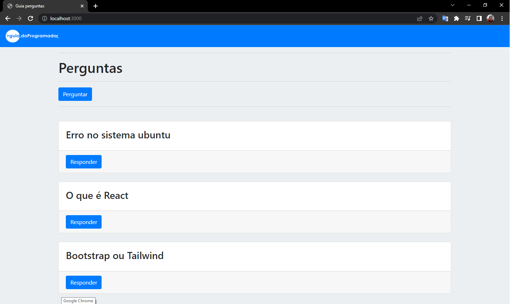
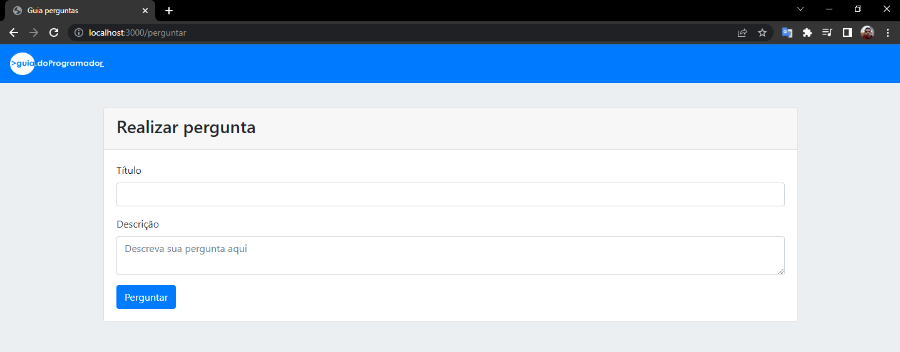
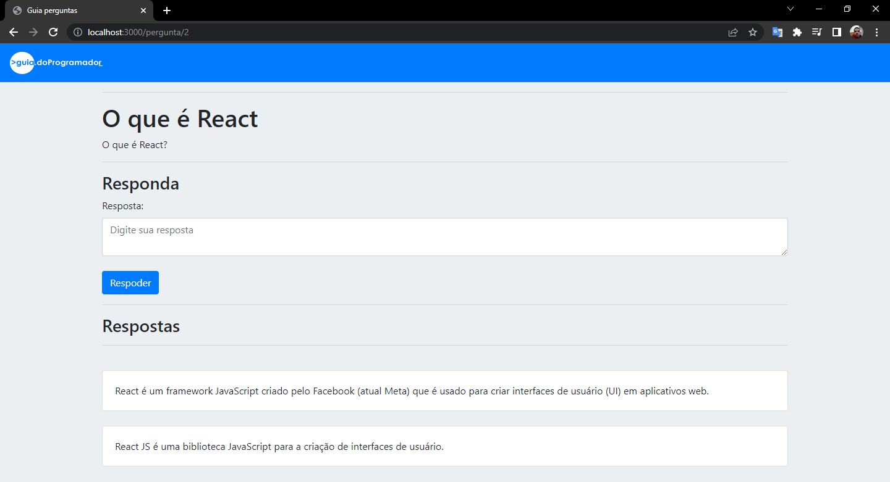

<h1 align="center">Pergunta e resposta com Node.js + Express + MySQL</h1>

Desenvolvido uma aplicação web utilizando o framework Express.js, EJS e Sequelize, com banco de dados MySQL.

## Início

Realizado um blog de Perguntas e respostas, deixando suas dúvidas e aguardando a resposta.

## Site

  

  

## Construído com:

* [Node.js](https://nodejs.org/en/)
* [Bootstrap](https://getbootstrap.com/)
* [MySQL](https://www.mysql.com)
