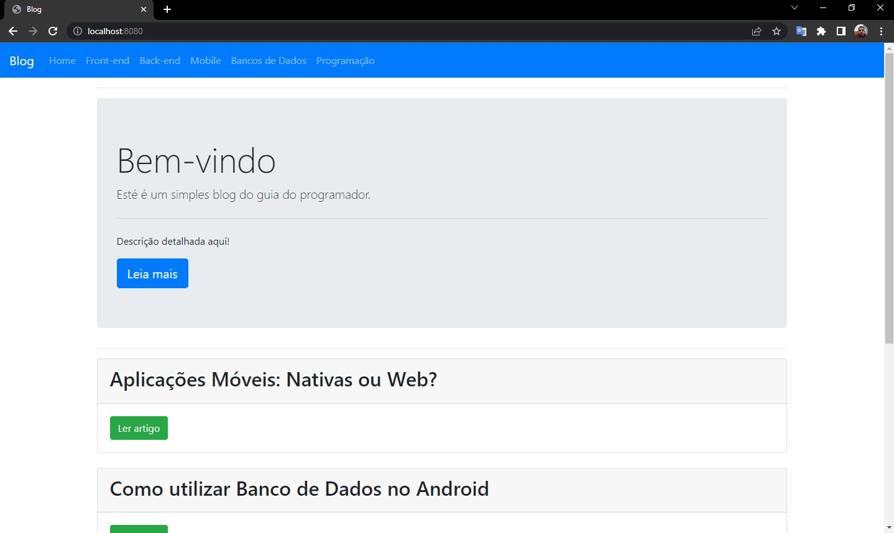
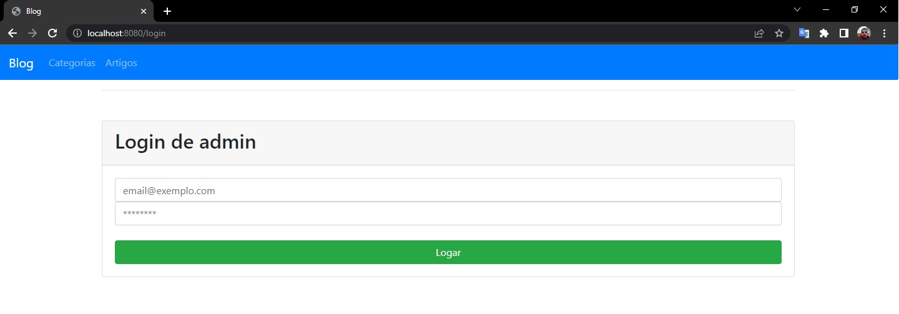
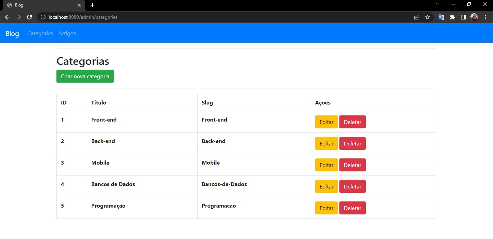
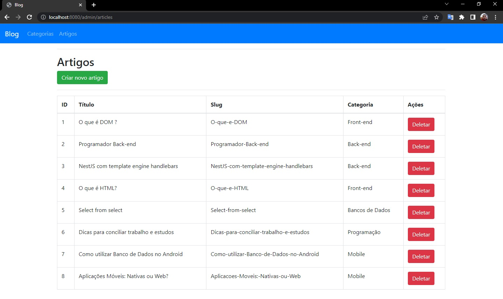
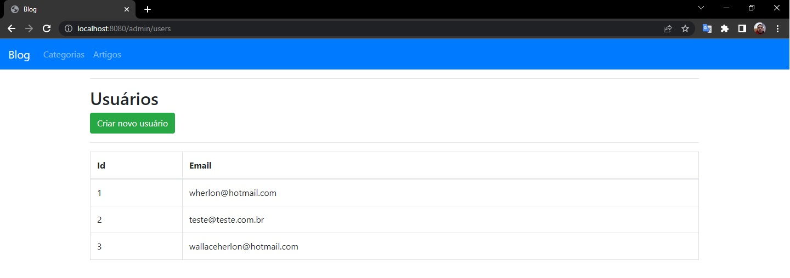

<h1 align="center">Blog com Node.js + Express + MySQL</h1>

Desenvolvido uma aplicação web utilizando o framework Express.js, EJS, bcryptjs e Sequelize, com banco de dados MySQL.

## Início

Realizado um blog de Artigos e Categorias, sistema de login de acesso as páginas, bcryptjs é uma ferramenta segura para armazenar senhas no banco de dados, manipulando sessão. 

## Site

  

  

  

  

## Construído com:

* [Node.js](https://nodejs.org/en/)
* [Bootstrap](https://getbootstrap.com/)
* [MySQL](https://www.mysql.com)
